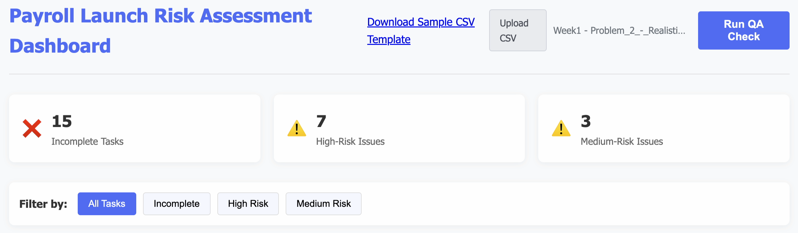
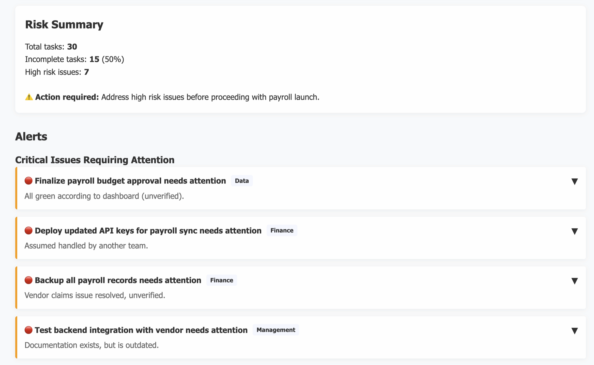
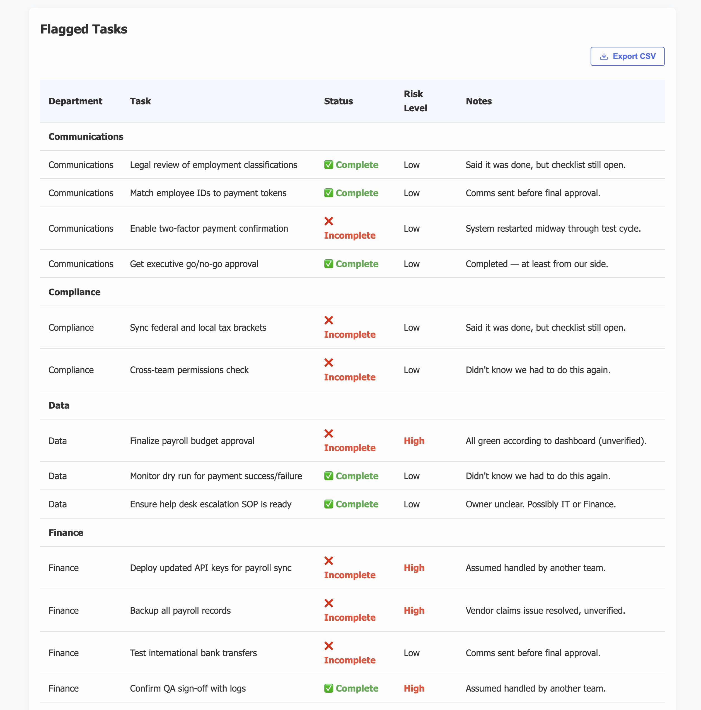

# Payroll Launch Risk Assessment Dashboard

A web-based dashboard for assessing and managing risks associated with payroll system launches.

## Dashboard Screenshots

### Dashboard Overview

The main dashboard provides quick access to upload CSV data and run quality assurance checks.

### Risk Summary

Summary cards provide at-a-glance metrics of incomplete tasks and risk levels across the payroll system.

### Critical Issues

The alerts section shows critical issues requiring immediate attention before proceeding with payroll launch.

## Features

### Data Import and Processing
- CSV file upload functionality for payroll task data
- Automatic parsing and processing of CSV data
- Support for department, task, completion status, and notes fields

### Risk Analysis
- Automatic risk assessment based on task completion status
- Keyword-based risk detection in task notes
- Three-tier risk classification (high, medium, low)
- Risk keywords detection for terms like "assumed", "unverified", "outdated", etc.

### Dashboard Overview
- Summary cards showing key metrics:
  - Incomplete tasks count
  - High-risk issues count
  - Medium-risk issues count
- Percentage calculations of incomplete vs. total tasks
- Visual indicators for risk levels

### Task Management
- Department-based task grouping
- Task status tracking (complete/incomplete)
- Risk level indicators for each task
- Detailed notes display for each task

### Filtering and Search
- Filter controls for viewing specific task categories:
  - All tasks
  - Incomplete tasks
  - High-risk tasks
  - Medium-risk tasks
- Real-time search functionality for finding specific tasks

### Critical Issues Alerts
- Automatic identification of high-risk incomplete tasks
- Department-based alert grouping
- Expandable alert details with suggestions
- Comment system for team communication on alerts

### QA Checklist
- Interactive checklist for quality assurance
- Department-based checklist organization
- Task completion tracking
- Status indicators for checklist items

### Data Export
- Export functionality for risk assessment data to CSV
- Export alerts to CSV with suggested actions
- Downloadable QA checklist

### User Interface
- Clean, modern interface with responsive design
- Color-coded risk indicators
- Expandable sections for detailed information
- Mobile-friendly layout adjustments

### Python Risk Analysis Integration
- Backend Python script for advanced risk analysis
- JSON and text output formats for analysis results
- Integration with web dashboard

## Technical Details
- Built with vanilla JavaScript, HTML, and CSS
- No external dependencies required
- Client-side data processing for privacy
- Responsive design for desktop and mobile devices